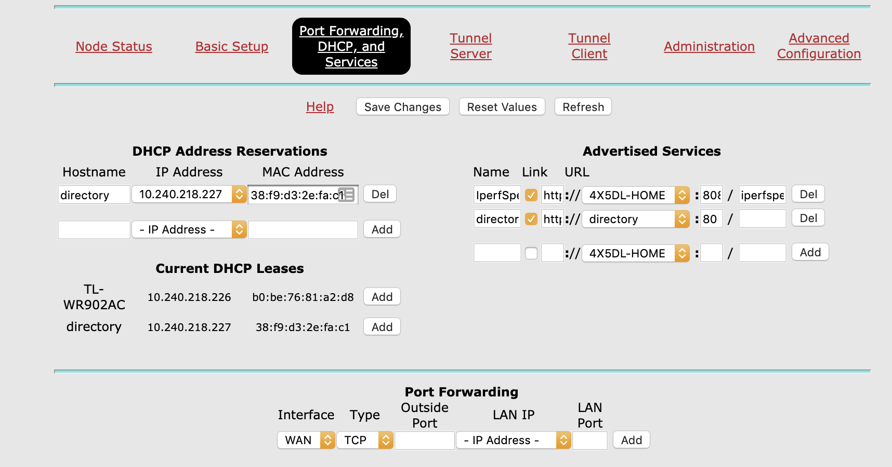
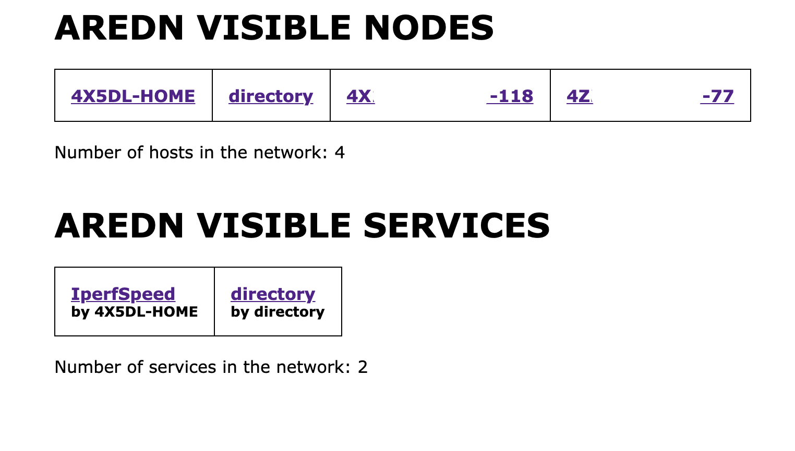

# Nodes and Services Discovery for AREDN
served in a simple HTML table as an easy to use internal network directory,

AREDN stands for Amateur Radio Emergency Data Network.

Written by Yaniv Eliash, 4X5DL

# Compile
Compile with `go build` for your desired architecture

- Cross compile for Raspberry Pi: `env GOOS=linux GOARCH=arm GOARM=7 go build -o aredn_ss_arm`
- Cross compile for OSX: `GOOS=darwin GOARCH=amd64 go build -o aredn_ss_osx`
- Cross compile for Linux: `GOOS=linux GOARCH=amd64 go build -o aredn_ss_linux`

> Pre-Compiled can be found [here](https://github.com/geostant/aredn_discovery/releases)

# Usage
Run on a raspberry pi or any other machine that connected to the AREDN network by executing the file and running it in the background,
for example `./aredn_ss_arm &` (for long term - better to use `screen` or other method to run on boot in the background)

Trying to execute this file on a disconnected machine will result in error.

Once the app is running, add it to your services in your local node,
the server publish port 80.

Setup the directory service as any other service (I like to name my host as `directory`)

How the screen will looks like, populated with nodes and services

 
**I'm always happy to receive any feedback (negative and positive) and other ideas on enhancing this tool.**
